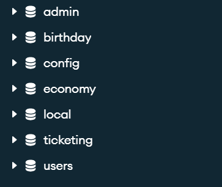
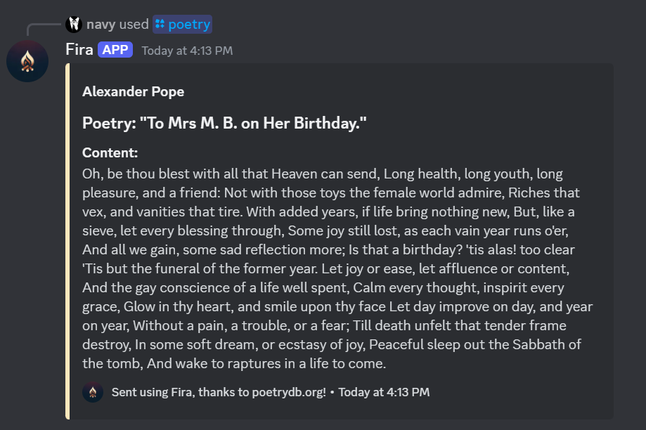
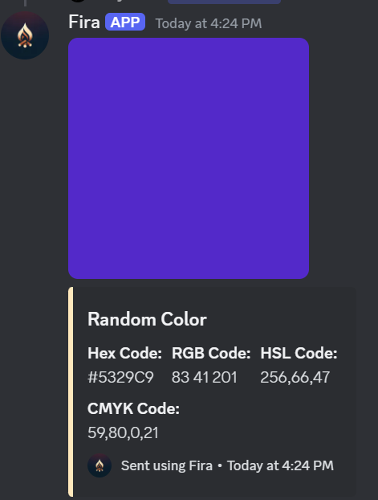
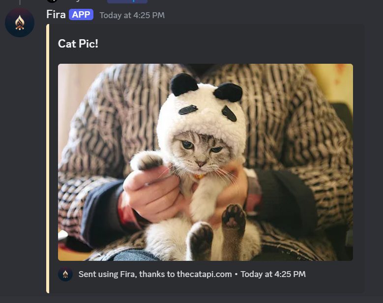
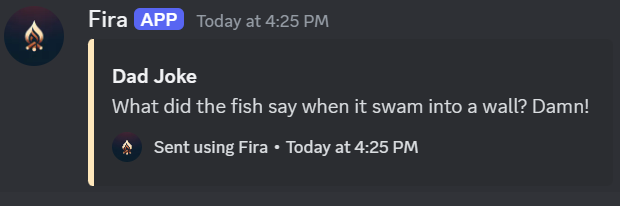

# Fira Discord Bot
___
## Installation
___

### Clone Method
Clone the repository and then run `npm install`

After all the node modules have installed, configure the .env file to ensure the bot starts up normally.

#### MongoDB Configuration

Create the database in this manner and the discord bot will automatically create all the documents below it!

#### ENV Configuration (All Strings)
The MONGODB connection strings should be like this: "mongodb://localhost:27017/birthday"

TOKEN= \
CLIENTID= \
GUILDID= \
HCBAPIKEY= \
MONGOURLECONOMY= \
MONGOURLBIRTHDAY= \
MONGOURLUSERS= \
MONGOURLTICKET= \
MONGOURLCONFIG= 

After this the bot should automatically start clustering and sharding and start serving your users! 
___

## What it should look like

___

## Feel free to make contributions and suggestions.

